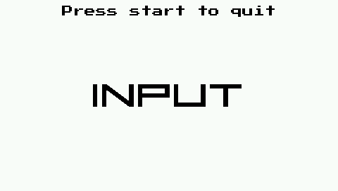

# PSP SDL2 OSK Example

This code is a simple example for text input for the Playstation Portable. This allows you to test if text input in SDL2 using the on screen keyboard is working like expected. At the moment of writing, it does not.

When testing the following should happen:

- When pressing Cross or A, text input will be enabled if supported. When test input is enabled "INPUT" will be displayed, then letters/text entered will be displayed on screen. When not supported "CAN'T" will be displayed on screen.
- When pressing Circle or B, text input will be disabled. "NO INPUT" will be displayed on screen.
- When pressing Triangle or Y, text input will be enabled without doing any checking.  When test input is enabled "INPUT" will be displayed, then letters/text entered will be displayed on screen.

Pressing Start or Escape will close the app.



The app was purposely made to work on both PC and PSP, to have a bit of an idea of what should be happening and if the code is alright.

## Building

### PSP

```
mkdir psp && cd psp
psp-cmake -DBUILD_PRX=1 ..
make
```

### PC

```
mkdir build && cd build
cmake ..
make
```

### VITA

```
mkdir vita && cd vita
cmake -DCMAKE_TOOLCHAIN_FILE="${VITASDK}/share/vita.toolchain.cmake" ..
make
```

## License

To the code the Unlicense applies. To the font files the following MIT license applies:

```
MIT License

Copyright (c) 2019 Axel Wikström

Permission is hereby granted, free of charge, to any person obtaining a copy
of this software and associated documentation files (the "Software"), to deal
in the Software without restriction, including without limitation the rights
to use, copy, modify, merge, publish, distribute, sublicense, and/or sell
copies of the Software, and to permit persons to whom the Software is
furnished to do so, subject to the following conditions:

The above copyright notice and this permission notice shall be included in all
copies or substantial portions of the Software.

THE SOFTWARE IS PROVIDED "AS IS", WITHOUT WARRANTY OF ANY KIND, EXPRESS OR
IMPLIED, INCLUDING BUT NOT LIMITED TO THE WARRANTIES OF MERCHANTABILITY,
FITNESS FOR A PARTICULAR PURPOSE AND NONINFRINGEMENT. IN NO EVENT SHALL THE
AUTHORS OR COPYRIGHT HOLDERS BE LIABLE FOR ANY CLAIM, DAMAGES OR OTHER
LIABILITY, WHETHER IN AN ACTION OF CONTRACT, TORT OR OTHERWISE, ARISING FROM,
OUT OF OR IN CONNECTION WITH THE SOFTWARE OR THE USE OR OTHER DEALINGS IN THE
SOFTWARE.
```
